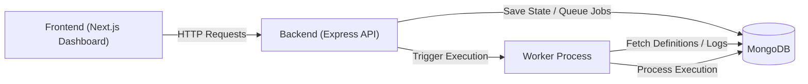
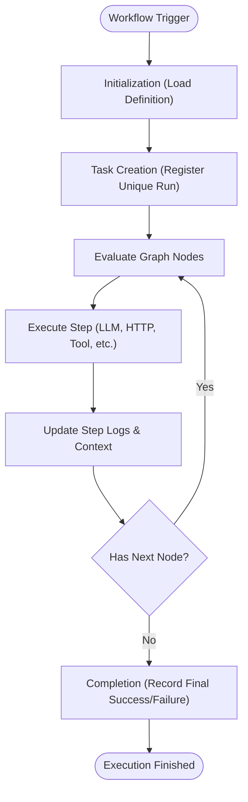
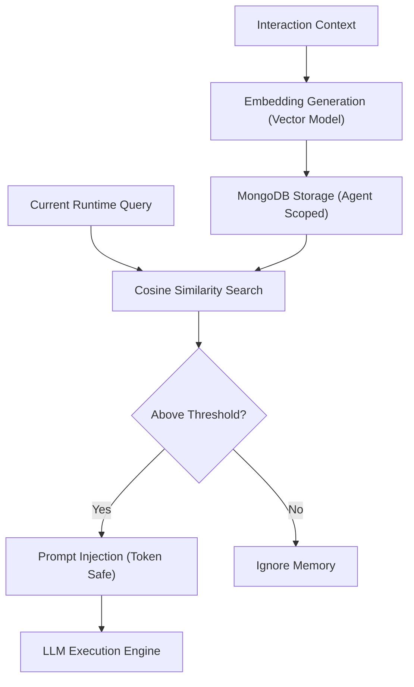
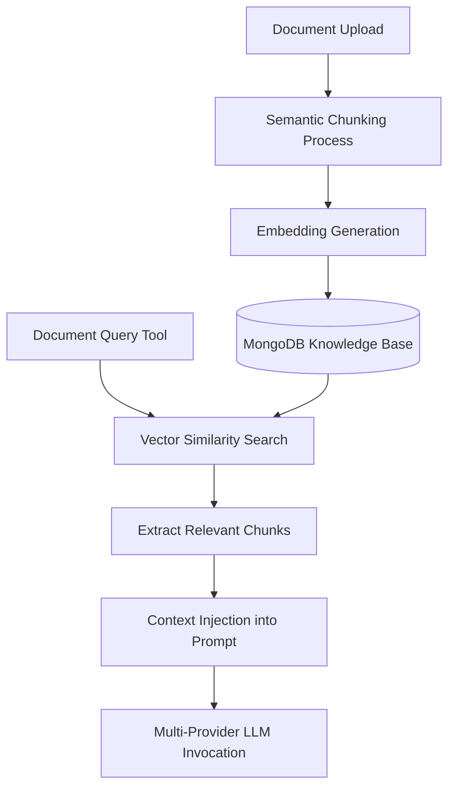
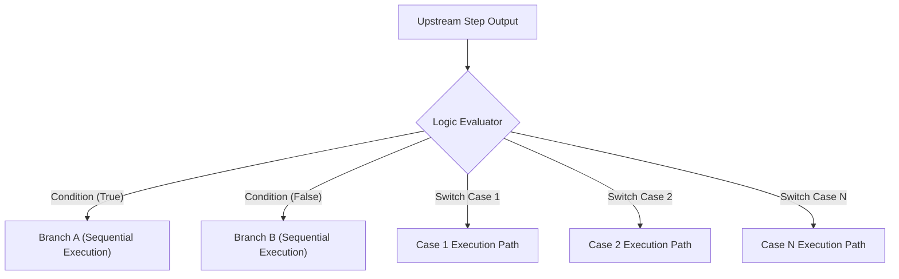

# Architecture Documentation

## Frontend → Backend → Worker Flow

```mermaid
graph LR
    Frontend["Frontend (Next.js Dashboard)"] -- HTTP Requests --> Backend["Backend (Express API)"]
    Backend -- Save State / Queue Jobs --> DB[("MongoDB")]
    Backend -- Trigger Execution --> Worker["Worker Process"]
    Worker -- Fetch Definitions / Logs --> DB
    Worker -- Process Execution --> DB
```

## Workflow Execution Lifecycle

```mermaid
graph TD
    Start([Workflow Trigger]) --> Init["Initialization (Load Definition)"]
    Init --> TaskCreate["Task Creation (Register Unique Run)"]
    TaskCreate --> EvalNodes["Evaluate Graph Nodes"]
    EvalNodes --> ExecuteNode["Execute Step (LLM, HTTP, Tool, etc.)"]
    ExecuteNode --> LogUpdate["Update Step Logs & Context"]
    LogUpdate --> CheckNext{Has Next Node?}
    CheckNext -- Yes --> EvalNodes
    CheckNext -- No --> Finalize["Completion (Record Final Success/Failure)"]
    Finalize --> End([Execution Finished])
```

## Semantic Memory Architecture

```mermaid
graph TD
    Context["Interaction Context"] --> EmbedGen["Embedding Generation (Vector Model)"]
    EmbedGen --> Storage["MongoDB Storage (Agent Scoped)"]
    
    Query["Current Runtime Query"] --> Search["Cosine Similarity Search"]
    Storage --> Search
    Search --> Filter{"Above Threshold?"}
    Filter -- Yes --> Inject["Prompt Injection (Token Safe)"]
    Filter -- No --> Ignore["Ignore Memory"]
    Inject --> LLM["LLM Execution Engine"]
```

## Document RAG Pipeline

```mermaid
graph TD
    Upload["Document Upload"] --> Chunking["Semantic Chunking Process"]
    Chunking --> Vectors["Embedding Generation"]
    Vectors --> DB[("MongoDB Knowledge Base")]
    
    StepQuery["Document Query Tool"] --> Similarity["Vector Similarity Search"]
    DB --> Similarity
    Similarity --> Extract["Extract Relevant Chunks"]
    Extract --> ContextInject["Context Injection into Prompt"]
    ContextInject --> Model["Multi-Provider LLM Invocation"]
```

## Branch Routing System

```mermaid
graph TD
    StepOutput["Upstream Step Output"] --> RoutingNode{"Logic Evaluator"}
    
    RoutingNode -- "Condition (True)" --> BranchA["Branch A (Sequential Execution)"]
    RoutingNode -- "Condition (False)" --> BranchB["Branch B (Sequential Execution)"]
    
    RoutingNode -- "Switch Case 1" --> Case1["Case 1 Execution Path"]
    RoutingNode -- "Switch Case 2" --> Case2["Case 2 Execution Path"]
    RoutingNode -- "Switch Case N" --> CaseN["Case N Execution Path"]
```